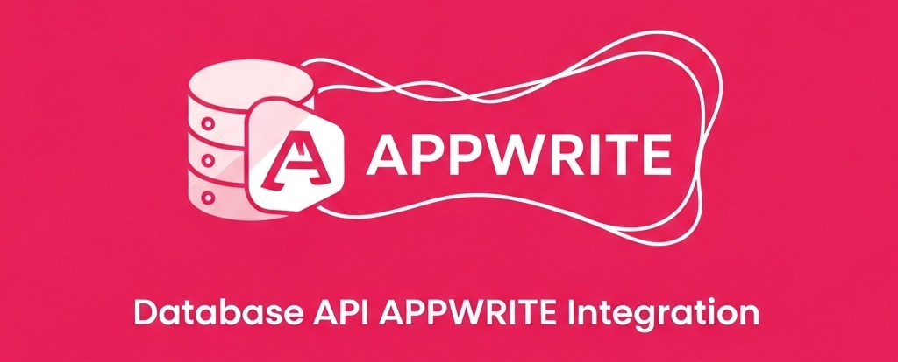

# Database API Appwrite Integration

An **API** designed for real-time data processing and RESTful endpoint provision, facilitating seamless interaction with **Appwrite**. This project serves as a crucial backend component for [**Dory Bot**](https://github.com/jesusalbujas/dory-bot), a versatile Discord bot capable of managing a wide array of tasks.

